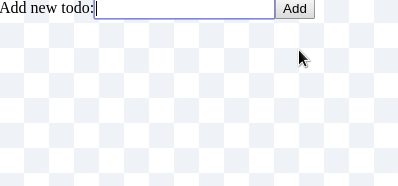

> Simple, type safe and time travelling state management for React

[](https://travis-ci.com/NiGhTTraX/react-state-connect)
[](https://codecov.io/gh/NiGhTTraX/react-state-connect)

----

## Usage

```typescript jsx
import connectToState, { StateContainer } from 'react-state-connect';
import React from 'react';
import ReactDOM from 'react-dom';

interface CounterState {
  count: number;
}

class CounterContainer extends StateContainer<CounterState> {
  state = {
    count: 0
  };

  increment() {
    this.setState({ count: this.state.count + 1 });
  }
}

interface CounterViewProps {
  counter: CounterContainer;
}

const CounterView = ({ counter }: CounterViewProps) => <div>
  <span>{counter.state.count}</span>
  <button onClick={() => counter.increment()}>+</button>
</div>;

const ConnectedCounterView = connectToState(
  CounterView,
  new CounterContainer(),
  'counter'
);

ReactDOM.render(
  <ConnectedCounterView />,
  document.getElementById('root')
);
```

### `StateContainer<State>`

This is a very simple abstract base class that provides a private
`setState` method similar to React which will update the internal state
and notify all listeners. Unlike React though, this method is synchronous
so there's no danger in reading the current state while updating it.

If your container needs some dependencies in order to work you can pass
them through the constructor.

```typescript jsx
import { StateContainer } from 'react-state-connect';

class MyStateContainer extends StateContainer<{ foo: number }> {
  constructor(private foo: number) {
    super();
    this.state = { foo };
  }
  
  increment() {
    this.setState({ foo: this.foo + 1 });
  }
}

const container = new MyStateContainer(42);
container.increment();
console.log(container.state.foo); // 43
```

### `connectToState(View, container, propName)`

The method takes a component and a state container and connects them
together so that whenever the container updates its state the view
will be re-rendered. The returned HOC will accept the same props as
the original component, minus the prop that will hold the container.

You can connect the same container to multiple views in a singleton
pattern by just passing the same reference to multiple connect calls.

```typescript jsx
import connectToState, { StateContainer } from 'react-state-connect';
import React from 'react';

class MyStateContainer extends StateContainer<any> { }
const container = new MyStateContainer();

const View1 = ({ foo }: { foo: StateContainer<any> }) => null;
const View2 = ({ bar }: { foo: StateContainer<any> }) => null;

const ConnectedView1 = connectToState(View1, container, 'foo');
const ConnectedView2 = connectToState(View2, container, 'bar');
```

You can also chain multiple `connectToState` calls to connect a view
to multiple containers.

```typescript jsx
import connectToState, { StateContainer } from 'react-state-connect';
import React from 'react';

class MyStateContainer extends StateContainer<any> { }

interface ViewProps {
  foo: StateContainer<any>,
  bar: StateContainer<any>,
}

const View = ({ foo, bar }: ViewProps) => <div>...</div>;

const ConnectedView = connectToState(
  connectToState(View, new MyStateContainer(), 'foo'),
  new MyStateContainer(),
  'bar'
);
```


## Debugging and time travel



### `stateCommitGraph`

If you want to see how the state evolves, or who triggered a specific state
mutation, the lib exports a state container which holds the graph of all
state commits made by all the containers:

```typescript jsx
import { stateCommitGraph } from 'react-state-connect';

console.log(stateCommitGraph.state.branches[0]);
// [{
//   id: 1,
//   state: { todos: [], typingTodo: 'b' },
//   checkout,
//   instance
// }]
```

### `StateCommit`

Each `setState` call in a container will create a new commit in the state commit graph. Each commit has a `checkout` method which you can use to travel back in time. Checking out a commit will reset every container's state to the state they held at that moment in time.

### Branches

After a checkout, any new state commits will create a new branch. This way no commits are overridden and you can easily go back and forth between different paths of your state flow.

### `CommitGraphDebug`

Since the commit graph is a state container you can easily connect it to
a view to monitor your app's state in real time. The lib exports a view
that is already connected and renders the commit graph in a git tree
fashion and allows you to inspect the commits and perform checkouts.

```typescript jsx
import { CommitGraphDebug } from 'react-state-connect';
import React from 'react';
import ReactDOM from 'react-dom';

ReactDOM.render(<CommitGraphDebug />, document.getElementById('log'));
```


## Motivation

Turn this

```typescript jsx
import React, { Component } from 'react';

interface ViewState {
  foo: number
}

class View extends Component<{}, ViewState> {
  state = { foo: 1 };
  
  render() {
    return <div>
      Foo is {this.state.foo}
    </div>;
  }
  
  componentDidMount() {
    setInterval(() => this.setState(
      (prevState) => ({ foo: prevState.foo + 1 })
    ), 1000);
  }
}
```

into this

```typescript jsx
import connectToState, { StateContainer } from 'react-state-connect';
import React from 'react';

interface FooState {
  foo: number;
}

class FooContainer extends StateContainer<FooState> {
  state = { foo: 1 };
  
  constructor() {
    super();
    
    setInterval(() => {
      this.setState({ foo: this.state.foo + 1 });
    }, 1000);
  }
}

interface ViewProps {
  foo: StateContainer<FooState>
}

const View = (props: ViewProps) => <div>
  Foo is {props.foo.state.foo}
</div>;

const ConnectedView = connectToState(View, new FooContainer(), 'foo'); 
```

Decoupling state from your React views has some advantages. First of all,
you can test the state logic and the view logic separately. Secondly,
state will become easier to share between components because it will
set at a higher level from where it can be passed to multiple components.
Lastly, components can become more reusable by accepting a more generic
type of state. This becomes evident if you have components that are
coupled to APIs - by removing that state and creating a prop interface
for it, you can open up the component to receiving similar responses
from other APIs as well.


## Guiding principles

### Type safety

This lib is written in TypeScript and it makes sure that when you connect
a view to a state container the view will have a prop interface accepting
that type of container.

```typescript jsx
import connectToState, { StateContainer } from 'react-state-connect';

interface SomeState { foo: number; }
interface ADifferentState { bar: string; }

interface ViewProps {
  foo: StateContainer<SomeState>;
}
const View = (props: ViewProps) => null;

class SomeContainer extends StateContainer<SomeState> {}
class SomeOtherContainer extends StateContainer<ADifferentState> {}
const someContainer = new SomeContainer();
const someOtherContainer = new SomeOtherContainer();

// All good here.
connectToState(View, someContainer, 'foo');

// Will throw a compiler error because `View` does not accept `ADifferentState`.
connectToState(View, someOtherContainer, 'foo');

// Will throw a compiler error because `View` does not accept `bar`.
connectToState(View, someContainer, 'bar');
```

### Dependency Injection

Pulling away the state from the views and connecting them higher up
in the app can lead to loosely coupled components. Views can become more
reusable since their state and actions can be expressed through props
and callbacks. The state containers are simple classes with a very
minimal interface that can be implemented with or without this lib or
with other libs.

```typescript jsx
import connectToState, { StateContainer } from 'react-connect-state';
import React from 'react';

interface DropdownState {
  items: { id: number; name: string; }[];
}

interface DropdownContainer extends StateContainer<DropdownState> {
  delete: (id: number) => void;
}

interface DropdownProps {
  items: DropdownContainer;
}

const Dropdown = ({ items }: DropdownProps) => <select>
  {items.state.items.map(item => <option key={item.id}>
    <span>{item.name}</span>
    <button onClick={items.delete.bind(items, item.id)}>Delete</button>
  </option>)}
</select>;

// We're using the same Dropdown component and binding it to different
// state containers.
const UserDropdown = connectToState(Dropdown, new UsersContainer(), 'items');
const ArticlesDropdown = connectToState(Dropdown, new ArticlesContainer(), 'items');
```

### Easy testing

Separating state from views enables testing them separately in isolation.
Taking the first example from above, the tests might look something
like this:

```typescript jsx
import { StateContainer } from 'react-state-connect';
import { describe, it } from 'mocha';
import { spy } from 'sinon';
import { expect } from 'chai';
import { CounterContainer, CounterView, CounterState } from '../src';

describe('CounterContainer', () => {
  it('should start at zero', () => {
    expect(new CounterContainer().state.count).to.equal(0);
  });
  
  it('should increment', () => {
    const counter = new CounterContainer();
    counter.increment();
    expect(counter.state.count).to.equal(1);
  });
});

describe('CounterView', () => {
  class CounterMock extends StateContainer<CounterState> {
    state = { count: 23 };
    
    increment = spy();
  }
  
  it('should display the counter', () => {
    const container = new CounterMock();
    const component = render(<CounterView counter={container} />);
    expect(component.text()).to.include('23');
  });
  
  it('should call to increment', () => {
    const container = new CounterMock();
    const component = render(<CounterView counter={container} />);
    component.click('button');
    expect(container.increment).to.have.been.calledOnce;
  });
});
```


## More examples

### Exporting a connected component

You can of course connect a view to a container when exporting it from
a module.

```typescript jsx
import connectToState from 'react-state-connect';
import CounterContainer from './counter-container';

interface CounterViewProps {
  counter: CounterContainer
}

const CounterView = ({ counter }: CounterViewProps) => null;

export default connectToState(
  CounterView,
  new CounterContainer(),
  'counter'
);
```

This pattern is perfectly valid, though it couples the view to the
state container so it can't be used without it. This increases "out of
the box readiness" at the expense of loose coupling.

### Connecting a component inline

```typescript jsx
import connectToState from 'react-state-connect';
import container from './container';
import CounterView from './view';
import React from 'react';

// Connect the view once, outside your render method.
const ConnectedCounterView = connectToState(CounterView, container, 'foo');

// And now use it in your exported component.
export default () => <div>
  <ConnectedCounterView />
</div>;
```

This is the same as exporting a connected component although it happens
higher up the call stack - the `CounterView` component is reusable and
can be connected to any container and the component we're exporting
binds it to a particular container, effectively binding itself to that
container.

### Expressing dependencies between containers

You can subscribe to containers via their `subscribe` method so there's
nothing from stopping a container listening to another container: just
pass their instances in the constructor and subscribe to them there.

```typescript jsx
import connectToState, { StateContainer } from 'react-state-connect';
import React from 'react';
import ReactDOM from 'react-dom';

interface ToggleState {
  toggled: number;
}

class Toggle extends StateContainer<ToggleState> {
  state = { toggled: false };
  
  toggle = () => {
    this.setState({ toggled: !this.state.toggled });
  }
}

interface ToggleCountState {
  on: number;
  off: number;
}

const ToggleView = ({ toggle }: { toggle: StateContainer<ToggleState> }) => <div>
  {toggle.state.toggled ? 'I am on' : 'I am off'}
  <button onClick={toggle.toggle}>Toggle me!</button>
</div>;

class ToggleCount extends StateContainer<ToggleCountState> {
  state = { on: 0, off: 0 };
  
  constructor(toggle: StateContainer<ToggleState>) {
    super();
    toggle.subscribe(this.onToggle);
  }
  
  onToggle = (toggleState: ToggleCountState) => {
    if (toggleState.toggled) {
      this.setState({ on: this.state.on + 1 });
    } else {
      this.setState({ off: this.state.off + 1 });
    }
  }
}

const ToggleCountView = ({ toggleCount }: { toggleCount: StateContainer<ToggleCountState> }) => <div>
  <p>Number of times toggled on: {toggleCount.state.on}</p>
  <p>Number of times toggled off: {toggleCount.state.off}</p>
</div>;

const toggle = new Toggle();
const toggleCount = new ToggleCount(toggle);

const ConnectedToggle = connectToState(ToggleView, toggle, 'toggle');
const ConnectedToggleCount = connectToState(ToggleCountView, toggleCount, 'toggleCount');

ReactDOM.render(<div>
  <ConnectedToggle />
  <ConnectedToggleCount />
</div>, document.getElementById('root'));
```
